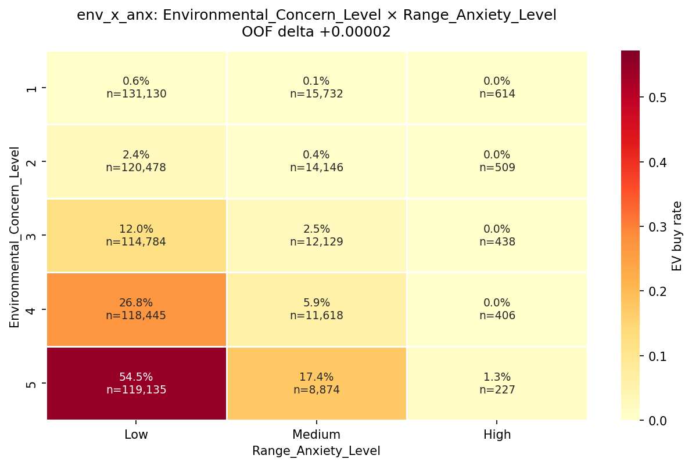
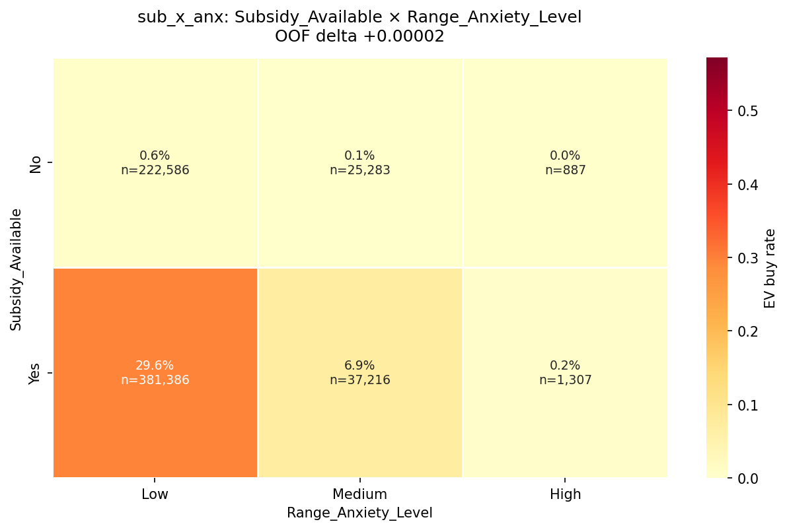
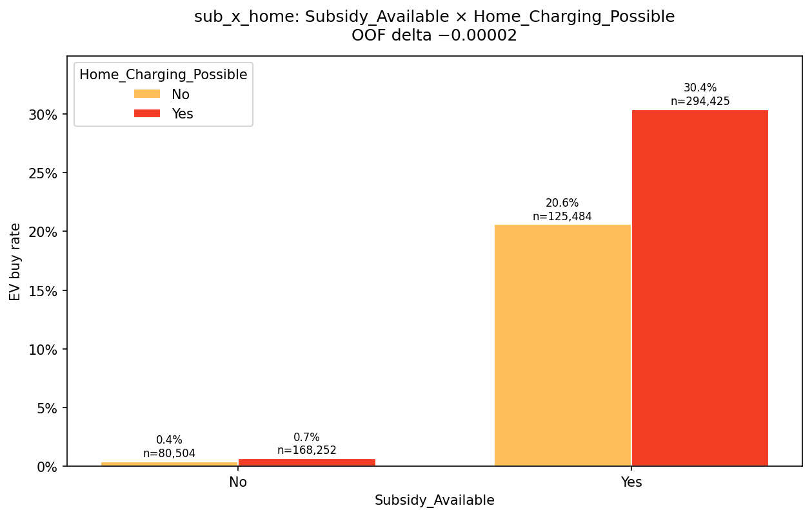
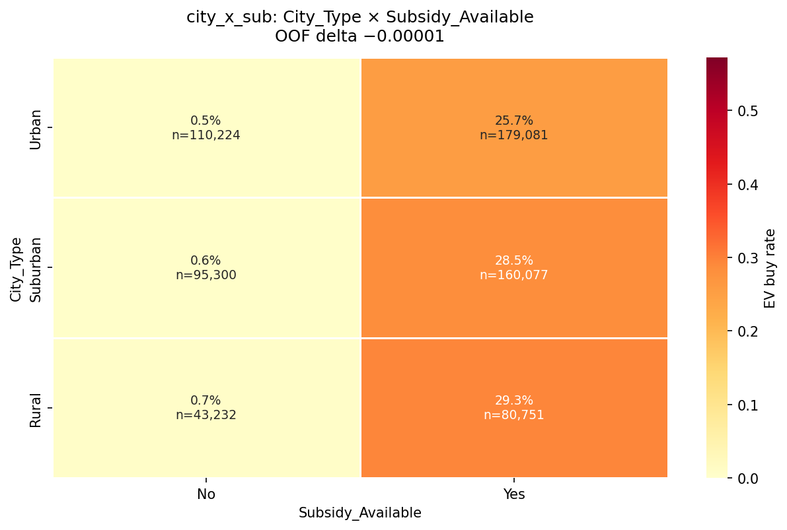
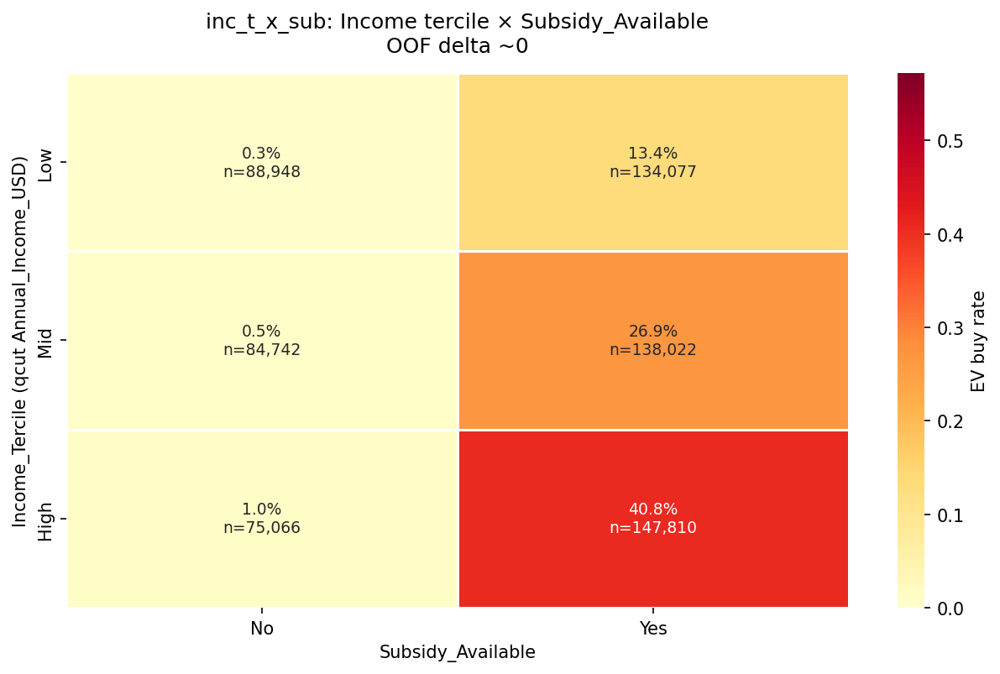
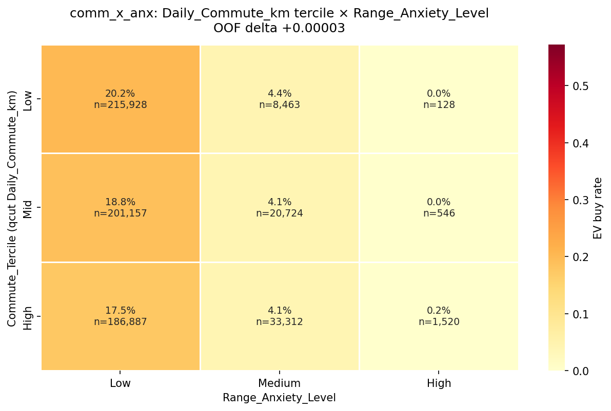
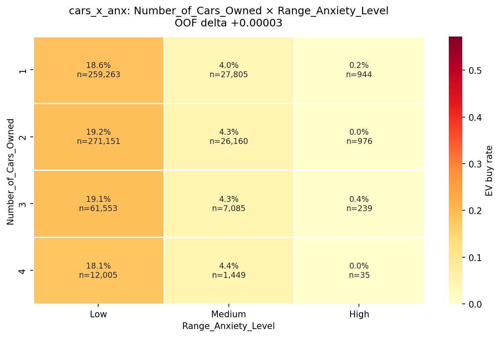

# EV purchase-rate interaction graphs

Exploratory data analysis (EDA) of raw **P(Will_Buy_EV = Yes)** by feature pairs on the playground-series-s6e9 train set. These are **observed rates**, not OOF model lifts — the OOF deltas below come from a separate interaction drip and are tiny relative to the drip baselines (~**0.9413**). Tree models already capture most of these effects, so the deltas are near noise; the heatmaps are for intuition.

Overall train Yes rate: **17.46%** (n=668,665).

**[View the interactive gallery →](figures/interactions/interactions_gallery.html)** — browse all 7 charts with captions in a single page.

## Index

| File | Pair | OOF delta | Why graphed |
| --- | --- | --- | --- |
| `env_x_anx.png` | Environmental_Concern_Level × Range_Anxiety_Level | +0.00002 | EDA purchase-rate grid for concern × anxiety; small positive OOF drip. |
| `sub_x_anx.png` | Subsidy_Available × Range_Anxiety_Level | +0.00002 | Subsidy vs anxiety purchase rates; small positive OOF drip. |
| `sub_x_home.png` | Subsidy_Available × Home_Charging_Possible | −0.00002 | Binary×binary subsidy × home charging; slight negative OOF drip. |
| `city_x_sub.png` | City_Type × Subsidy_Available | −0.00001 | City type × subsidy rates; near-flat / slight negative OOF. |
| `inc_t_x_sub.png` | Income tercile × Subsidy_Available | ~0 | Income tercile × subsidy; OOF delta ≈ 0 (null-ish interaction). |
| `comm_x_anx.png` | Daily_Commute_km tercile × Range_Anxiety_Level | +0.00003 | Commute tercile × anxiety; strongest positive among this drip set (+0.00003). |
| `cars_x_anx.png` | Number_of_Cars_Owned × Range_Anxiety_Level | +0.00003 | Cars owned × anxiety; same ballpark positive OOF as commute×anxiety. |

## Charts

### `env_x_anx` — Environmental_Concern_Level × Range_Anxiety_Level

OOF delta: **+0.00002**. EDA purchase-rate grid for concern × anxiety; small positive OOF drip.

### `sub_x_anx` — Subsidy_Available × Range_Anxiety_Level

OOF delta: **+0.00002**. Subsidy vs anxiety purchase rates; small positive OOF drip.

### `sub_x_home` — Subsidy_Available × Home_Charging_Possible

OOF delta: **−0.00002**. Binary×binary subsidy × home charging; slight negative OOF drip.

### `city_x_sub` — City_Type × Subsidy_Available

OOF delta: **−0.00001**. City type × subsidy rates; near-flat / slight negative OOF.

### `inc_t_x_sub` — Income tercile × Subsidy_Available

OOF delta: **~0**. Income tercile × subsidy; OOF delta ≈ 0 (null-ish interaction).

### `comm_x_anx` — Daily_Commute_km tercile × Range_Anxiety_Level

OOF delta: **+0.00003**. Commute tercile × anxiety; strongest positive among this drip set (+0.00003).

### `cars_x_anx` — Number_of_Cars_Owned × Range_Anxiety_Level

OOF delta: **+0.00003**. Cars owned × anxiety; same ballpark positive OOF as commute×anxiety.

